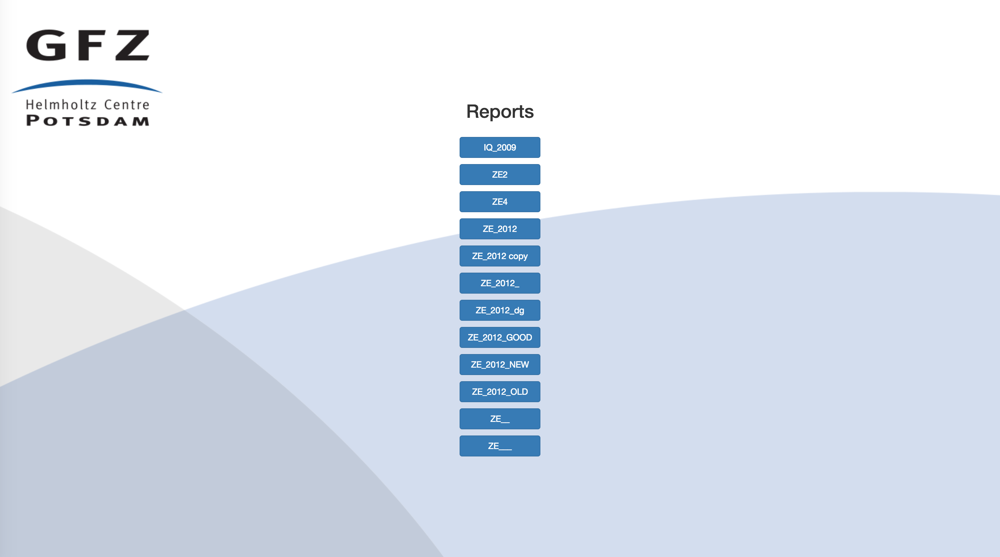

.. _gfzw:

gfzreport-web
=============

:package: ``gfzreport.web``

:command line: None

:ref:`gfzr` can run on a web server. After creating report templates via :ref:`gfzt`,
:ref:`gfzw` allows online :ref:`rst` editing by means of :ref:`gfzb`.

When saving after editing, the web application also executes a ``git commit`` on the :ref:`srcdir`
to allow a revision system
which can be exploited from within the GUI. When building a document by means of :ref:`gfzb`,
its ``.log`` file is parsed and shown formatted in a browser window.

The editor is configured to give authorization to certain users only, configurable in a ``users.txt`` file (see below).
Moreover, the user can upload images and the application takes care of inserting the relative :ref:`rst` syntax
in order to render them when building the document.

I/O Directory structure
-----------------------

.. _webappdatapath:

Data path
^^^^^^^^^

The web application data directory. **It must have a sub-dicrectory named "source"**. Therein, all
directories not starting with "_" will be considered a :ref:`srcdir` and loaded as report
into the application. Each :ref:`srcdir` was most likely previously created with :ref:`gfzt`.

When building a document from the webapp from a report, located e.g. at:

:ref:`webappdatapath`/source/report1

Then the output will be put into

:ref:`webappdatapath`/build/report1/html (|html| build type) or 

:ref:`webappdatapath`/build/report1/latex (|latex| or |pdf| build type)

The build output path will be created if non-existing. This structure allows us to have
a single filesystem root for our web application (:ref:`webappdatapath`), but also
a single silesystem root for all **necessary and important** application data
(:ref:`webappdatapath`/source), useful when we want to move / copy / backup

.. _webappdbpath:

Database path
^^^^^^^^^^^^^

The web application database directory. It will create (or read from, if already present) the
following files:

.. _webappdb:

users.sqlite
************

This is the database of the users. It stores information for the application, e.g. users emails,
passwords (not yet implemented), session login time and authorization to the projects

.. _webappusers:

users.txt
*********

Thie is the (json) text file whereby initialize the users when starting each new instance of
the web app. 

The file has the following format:

.. code-block:: python

   # simple json file which sets up users and permissions
   # (REMEBER TO QUOTE STRINGS WITH " AS THAT IS VALID JSON, NOT ')
   # First of all, note that comments are not json standard. HOWEVER, any line
   # starting with # will be removed from the parser implemented in this program.
   # Specify below an array of users. Each array element:
   #  - MUST BE A dict
   #  - MUST contain a valid email (@ must be in email, neither in first nor last position)
   # Any other field defined in models.py is optional. path_restriction_reg, if missing, will default
   # to ".*", i.e. will give free access to the given user to all server paths.
   # Otherwise, the regexp will be matched
   # using re.search, which matches if the regex pattern matches ANY portion of a given path
   # (so use ^ and $ if a match from the beginning or until the end is needed)
   
   [
      {"email": "user1@mysite.com"},
      {"email": "user2@mysite.com", "path_restriction_reg": "/abc*$"},
   ]

When an instance of the app is invoked, if this file is does not exist,
the database will be empty and no user will be set. Otherwise,
users in this file and not present in :ref:`webappdb` will be added, users not present in this file
and present in :ref:`webappdb` will be deleted, and users whose authorization  ("path_restriction_reg")
is different will be updated.
Note that updating its element updates the relative database (new users, delete users eccetra)

Example (invoke app locally)
----------------------------

Assuming a directory ( e.g.: ``/home/data/gfzreport/network``) which will be used
as both as :ref:`webappdbpath` and :ref:`webappdbpath`:

   * |DIR| network
      
      * |DIR| source
      
         * |DIR| _skipped_report
         
         * |DIR| IQ_2009
         
         * |DIR| ZE2
         
         * |DIR| ...
      
      * |FILE| users.sqlite (optional, it will be created if non-existing)
      
      * |FILE| users.txt (optional, it will be created if non existing) 
   

You can invoke the web application locally with a script like this:

.. code-block:: python

   from gfzreport.web.app import get_app

   if __name__ == '__main__':
       PATH = '/home/data/gfzreport/network'
       os.environ['DATA_PATH'] = PATH
       os.environ['DB_PATH'] = PATH
       app = get_app()
       app.run(port=5000, debug=True)
       
Then, navigate to http://127.0.0.1:5000/ in your web browser and you should see something like
this (the appearence might change in future releases):

   The home page of a report type. Each button denotes a directory not starting with "_" in the 
   "source" sub-directory of the app data path

Remember to close the app from the terminal (CTRL+C) when finished.

Overview of the package
-----------------------

The package is organized as a classical Flask application. There is a single main package, ``app``,
and in its ``__init__.py`` file we defined the root function to start the web application:

.. code-block:: python
   
   gfzreport.web.app.get_app(config_obj='gfzreport.web.config_example.BaseConfig', data_path=None,
                             db_path=None, **custom_config_settings):

The config can be changed (although not necessarily in most cases)
by ``cp gfzreport/web/config_example.py gfzreport/web/config.py``
(``config.py`` is git ignored), modify ``config.py`` and pass ``gfzreport.web.config.BaseConfig``
to the app. The other two arguments are the :ref:`webappdatapath` the :ref:`webappdbpath` already discussed.
See source code documentation for further details.

The ``views.py``, ``core.py`` and ``models.py`` are modules containing the app views, the core functionalities
of ``views.py``, anb the users database ORM, respectively.

The ``static`` path has static js and css files (bootstrap for the css, angular and ace for js), and
the ``templates`` folder contains the jinja templates

